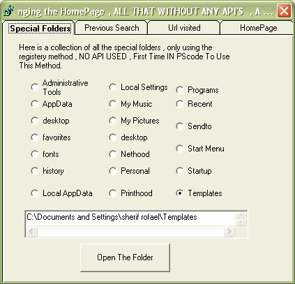



## Let's Play with The Registery

### Description

This program is a collection of the capabilities of using the Registery

To Get Data about Your PC and Writing Data Again,

It Conatins The Following :

1) Special Folder's Path's : ( ONLY 5 LINES OF CODE )

( 'Desktop' , 'Programs' , 'Favorites' , 'History' ,Administrative Tools; AppData;cookies;desktop;favorites

;fonts;history;Local AppData;Local settings;my music;my pictures

my vedio;nethood;personal;printhood;programs;recent;send to;start menu;startup;templates)

2)The Previous Keywords Used in Search , This words can't be removed ,

Now You can Remove it Very Easy or even replace it ,

3) The History of URL Visited , You can remove only one or two URLs or whatever without Loosing the Rest ,

4) Changing the HomePage ,

ALL THAT WITHOUT ANY API'S , A FREE API CODE .

----

NO One LINE OF API IS USED

----

 
### More Info
 

             |
---                |---
**Submitted On**   |2003-01-29 05:13:00
**By**             |[sherif  rofael](https://github.com/Planet-Source-Code/PSCIndex/blob/master/ByAuthor/sherif-rofael.md)
**Level**          |Beginner
**User Rating**    |4.7 (42 globes from 9 users)
**Compatibility**  |VB 4\.0 \(32\-bit\), VB 5\.0, VB 6\.0, ASP \(Active Server Pages\) 
**Category**       |[Data Structures](https://github.com/Planet-Source-Code/PSCIndex/blob/master/ByCategory/data-structures__1-33.md)
**World**          |[Visual Basic](https://github.com/Planet-Source-Code/PSCIndex/blob/master/ByWorld/visual-basic.md)
**Archive File**   |[Let's\_Play1536201292003\.zip](https://github.com/Planet-Source-Code/sherif-rofael-let-s-play-with-the-registery__1-42785/archive/master.zip)

